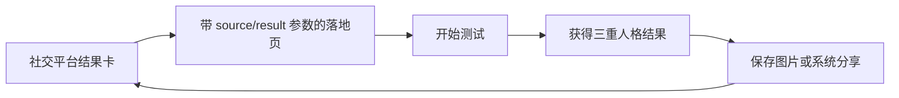

# 《甄嬛传》小主性格测试小游戏 PRD

> 文档版本：v1.0  
> 产品阶段：MVP / 可开发  
> 更新日期：2026-09-03  
> 适用端：Mobile Web（优先）/ Desktop Web（兼容）  
> 产品主题：10 位角色 × 8 个人格维度 × 12 道题

---

## 0. 文档目的

本文档用于直接指导产品设计、UI、前端开发、测试和上线验收。除明确标为“后续版本”的内容外，均视为 MVP 规格。

### 0.1 已确认范围

- 角色：甄嬛、沈眉庄、华妃、安陵容、皇后、叶澜依、端妃、敬妃、祺贵人、淳儿。
- 模型：谋略、锋芒、隐忍、共情、野心、独立、敏感、原则，共 8 个维度。
- 流程：首页 → 12 题答题页 → 分析动画页 → 结果页。
- 结果：本命人格、隐藏人格、黑化人格、匹配度、维度图、结果解读、分享卡。
- 视觉：现代 Editorial × 东方宫廷；克制、留白、纸张与朱砂感，避免廉价传统古风。

### 0.2 产品决策前提与风险

以下属于待验证假设，不应被视为事实：

- 用户愿意完成约 2–3 分钟的 12 题测试；若完成率低于 65%，优先缩短题干或改为 10 题实验，而不是直接删除模型维度。
- “角色匹配 + 可分享金句”能带来传播；以分享按钮点击率 ≥ 12%、分享回流访问占比 ≥ 8% 作为初步验证门槛。
- 剧集名称、人物名称、台词、剧照、服装造型等可能涉及知识产权。MVP 默认不使用官方剧照、海报、原台词、演员肖像或高度可识别的影视造型；正式商业化或投放前必须完成权利审查。
- 角色向量与题目权重是产品假设，不是心理学诊断。页面需注明“仅供娱乐，不构成专业心理评估”。

常见失败风险与防护：

- 结果集中到少数角色：上线前用模拟答卷和 30–50 人小样本检查角色分布，任一角色占比不宜超过 25%。
- 用户从选项直接猜角色：题目使用现代生活情境，不出现角色名、宫斗事件和角色标志性台词。
- 负面角色使用户拒绝分享：所有角色使用“优势—盲点—建议”结构，避免羞辱、诊断或道德裁决。
- 分享卡信息过多：分享卡只保留角色、三标签、金句、匹配度和二维码/短链。

---

## 1. 产品概述

### 1.1 一句话定义

一款以现代生活选择题测量“后宫生存人格”，将用户与 10 位《甄嬛传》角色进行向量匹配，并生成可传播人格卡片的轻量 H5 小游戏。

### 1.2 产品目标

1. 在 2–3 分钟内提供有角色辨识度、同时对用户友善的娱乐型人格结果。
2. 通过视觉质感、结果金句和三重人格机制，提高用户保存、分享和二次测试意愿。
3. 建立配置化题库、角色向量和文案结构，便于后续扩充角色、题目和主题皮肤。

### 1.3 非目标

- 不提供心理健康诊断或人格障碍判断。
- 不做登录、社交关系链、排行榜或公开评论区。
- 不在 MVP 中接入支付、会员或复杂后台。
- 不承诺与官方影视 IP 联名或授权。

### 1.4 核心成功指标

| 指标 | MVP 目标 | 说明 |
|---|---:|---|
| 首页开始率 | ≥ 55% | 点击“入宫测一测”/首页有效访问 |
| 答题完成率 | ≥ 65% | 到达结果页/开始答题 |
| 中位完成时长 | 90–210 秒 | 过短可能随便选，过长影响完成 |
| 分享意图率 | ≥ 12% | 点击分享/保存卡片/结果页访问 |
| 重测率 | 5%–20% | 过高可能代表结果不可信 |
| JS 错误会话率 | < 1% | 生产监控口径 |
| 结果生成成功率 | ≥ 99.5% | 已完成 12 题的会话 |

---

## 2. 用户与使用场景

### 2.1 核心用户

- 18–35 岁、熟悉《甄嬛传》角色梗和社交媒体表达的用户。
- 喜欢 MBTI、人格测试、角色测试和轻互动内容的用户。
- 通过小红书、微信、微博或群聊进入的移动端用户。

### 2.2 核心需求

- “我最像谁”：获得鲜明且有依据的角色归属。
- “结果懂我”：从优势、关系模式和压力反应中获得命中感。
- “值得发”：结果卡好看、文案不尴尬、朋友能快速看懂。
- “还能聊”：隐藏人格与黑化人格制造讨论和二次传播。

### 2.3 典型用户旅程

1. 用户从社交平台看到朋友分享卡。
2. 扫码或点链接进入带来源参数的首页。
3. 了解“12 题 / 约 2 分钟”，开始答题。
4. 单题单选，查看进度，可返回修改。
5. 完成后观看约 2.8 秒的分析动画。
6. 查看本命、隐藏、黑化人格和解释。
7. 保存分享卡或调用系统分享；好友通过卡片回流。

### 2.4 传播闭环



分享链接建议：`/?utm_source={channel}&ref_result={roleId}&share_id={anonymousId}`。`share_id` 不包含姓名、手机号或答题明细。

---

## 3. 信息架构与路由

| 页面 | 建议路由 | 核心任务 |
|---|---|---|
| 首页 | `/` | 建立兴趣与信任，开始测试 |
| 答题页 | `/quiz` | 完成 12 道单选题 |
| 分析页 | `/analyzing` | 反馈系统处理中，承接情绪 |
| 结果页 | `/result/:resultId` | 展示结果并促成分享/重测 |

### 3.1 状态流转

- 首页点击开始：创建匿名 `sessionId`，进入第 1 题。
- 每次选择：本地保存答案并在 180–260ms 后自动进入下一题。
- 第 12 题选择后：立即计算结果，保存后进入分析页。
- 分析动画完成且结果可用：进入结果页。
- 用户直接访问无效结果 URL：进入可恢复异常态，按钮返回首页。
- 浏览器刷新：若题库版本一致，从当前题恢复；若版本变化，提示重新开始。

---

## 4. 人格模型

### 4.1 八个维度

所有用户与角色维度最终映射到 0–100。

| ID | 中文 | English | 0 分倾向 | 100 分倾向 |
|---|---|---|---|---|
| `strategy` | 谋略 | Strategy | 即兴、直接 | 观察局势、长线规划 |
| `assertiveness` | 锋芒 | Assertiveness | 温和、回避对抗 | 主动表达、强势争取 |
| `restraint` | 隐忍 | Restraint | 当场反应 | 延迟表达、等待时机 |
| `empathy` | 共情 | Empathy | 任务/理性优先 | 高度感受他人情绪 |
| `ambition` | 野心 | Ambition | 随遇而安 | 强目标与竞争驱动 |
| `independence` | 独立 | Independence | 依赖关系与认可 | 自主、不讨好 |
| `sensitivity` | 敏感 | Sensitivity | 钝感、低警觉 | 捕捉细微信号 |
| `integrity` | 原则 | Integrity | 灵活务实 | 坚守边界与价值 |

“低分”不等于缺陷，“高分”也不等于更优秀；结果文案必须避免价值排序。

### 4.2 角色人格向量

| 角色 | strategy | assertiveness | restraint | empathy | ambition | independence | sensitivity | integrity |
|---|---:|---:|---:|---:|---:|---:|---:|---:|
| 甄嬛 | 90 | 70 | 80 | 80 | 70 | 80 | 70 | 70 |
| 沈眉庄 | 70 | 55 | 80 | 75 | 45 | 80 | 60 | 95 |
| 华妃 | 40 | 100 | 20 | 50 | 80 | 55 | 70 | 40 |
| 安陵容 | 75 | 40 | 85 | 65 | 80 | 30 | 100 | 30 |
| 皇后 | 100 | 55 | 100 | 25 | 95 | 65 | 85 | 20 |
| 叶澜依 | 55 | 80 | 35 | 55 | 35 | 100 | 65 | 75 |
| 端妃 | 90 | 45 | 100 | 70 | 60 | 75 | 80 | 70 |
| 敬妃 | 75 | 35 | 85 | 65 | 35 | 65 | 55 | 75 |
| 祺贵人 | 35 | 85 | 25 | 35 | 85 | 35 | 55 | 35 |
| 淳儿 | 20 | 45 | 20 | 85 | 20 | 45 | 30 | 70 |

---

## 5. 完整题库与选项权重

### 5.1 权重说明

- 每个选项包含一个或多个维度增量，范围为 `-2` 至 `+2`；未列出的维度增量为 `0`。
- 增量表达的是该选项相对本题其他选项的方向，不直接等于用户最终分数。
- 前端不得根据权重改变选项顺序或视觉强弱。
- 建议在会话级固定随机化选项顺序；同一会话返回上一题时顺序不变。

缩写：`STR` 谋略、`AST` 锋芒、`RES` 隐忍、`EMP` 共情、`AMB` 野心、`IND` 独立、`SEN` 敏感、`INT` 原则。

### Q1｜背后的那句话

你偶然发现，一个平时与你关系不错的人一直在背后说你坏话。你会：

| 选项 | 文案 | 权重 |
|---|---|---|
| A | 直接问清楚，我不喜欢猜 | AST +2, RES -2, IND +1 |
| B | 什么都不说，但会重新评估这段关系 | STR +1, RES +2, SEN +1 |
| C | 先弄清原因和传播范围，再决定怎么办 | STR +2, RES +1, SEN +1 |
| D | 会难受很久，反复想是不是自己做错了 | SEN +2, EMP +1, IND -2 |

### Q2｜突然出现的机会

公司出现一个很好的晋升机会，但竞争激烈。你更可能：

| 选项 | 文案 | 权重 |
|---|---|---|
| A | 明确争取，并认真想办法拿下来 | AMB +2, AST +2, STR +1 |
| B | 做好自己的事，结果顺其自然 | AMB -2, RES +1, IND +1 |
| C | 先观察局势，找到真正影响结果的人和事 | STR +2, RES +1, AMB +1 |
| D | 如果必须伤害别人，我宁愿不要 | INT +2, EMP +1, AMB -1 |

### Q3｜朋友受了委屈

你的好朋友被人明显欺负了。你会：

| 选项 | 文案 | 权重 |
|---|---|---|
| A | 谁欺负我朋友，我就直接去找谁 | AST +2, EMP +1, RES -2 |
| B | 先接住朋友的情绪，再一起想办法 | EMP +2, STR +1, INT +1 |
| C | 劝朋友及时止损，远离这种人 | IND +2, INT +1, EMP +1 |
| D | 表面不动声色，但这笔账我记住了 | RES +2, STR +2, SEN +1 |

### Q4｜陌生的聚会

你来到一个几乎谁都不认识的聚会。你通常会：

| 选项 | 文案 | 权重 |
|---|---|---|
| A | 主动开口，很快和大家聊起来 | AST +2, IND +1, SEN -1 |
| B | 先找到一个看起来舒服的人慢慢聊 | EMP +1, SEN +1, AST -1 |
| C | 先观察谁和谁熟、现场是什么氛围 | STR +2, SEN +2, RES +1 |
| D | 自己待着也可以，不强求融入 | IND +2, AMB -1, AST -1 |

### Q5｜功劳被拿走

你做了大部分工作，最后功劳却落在别人身上。你会：

| 选项 | 文案 | 权重 |
|---|---|---|
| A | 当场补充事实，让所有人知道贡献归属 | AST +2, INT +1, RES -1 |
| B | 保存证据，找合适时机与负责人单独沟通 | STR +2, RES +2, AMB +1 |
| C | 这次算了，但以后不会再给同样的机会 | IND +2, RES +1, SEN +1 |
| D | 很受伤，却担心说出来显得自己计较 | SEN +2, IND -2, EMP +1 |

### Q6｜计划突然被打乱

你准备很久的重要计划突然发生变化。你的第一反应是：

| 选项 | 文案 | 权重 |
|---|---|---|
| A | 立刻重排优先级，先保住最重要的目标 | STR +2, AMB +2, RES +1 |
| B | 烦就烦了，换条路也许更有意思 | IND +1, SEN -2, STR -1 |
| C | 先确认变化对每个人的影响，再协调方案 | EMP +2, STR +1, INT +1 |
| D | 会焦虑，但暂时不让别人看出来 | SEN +2, RES +2, AST -1 |

### Q7｜关系中的冷淡

重要的人突然对你冷淡，却说“没什么”。你会：

| 选项 | 文案 | 权重 |
|---|---|---|
| A | 直接问清楚，不接受长期猜谜 | AST +2, IND +1, RES -1 |
| B | 给对方空间，等愿意说时再聊 | EMP +2, RES +1, INT +1 |
| C | 从语气和细节里推测发生了什么 | SEN +2, STR +1, IND -1 |
| D | 先把注意力收回自己，不追着证明关系 | IND +2, SEN -1, EMP -1 |

### Q8｜团队意见冲突

团队对一个重要方案争执不下。你更倾向于：

| 选项 | 文案 | 权重 |
|---|---|---|
| A | 明确推动我认为最有效的方案 | AST +2, AMB +2, EMP -1 |
| B | 找共同目标，把各方意见拼成可执行方案 | STR +2, EMP +2, RES +1 |
| C | 哪个方案符合底线就支持哪个 | INT +2, IND +1, AMB -1 |
| D | 先不站队，等更多信息出现 | RES +2, STR +1, AST -1 |

### Q9｜发现规则不公平

你发现一条规则明显偏向少数人。你会：

| 选项 | 文案 | 权重 |
|---|---|---|
| A | 公开提出质疑，哪怕场面不好看 | INT +2, AST +2, RES -2 |
| B | 找到能改变规则的人，私下推动调整 | STR +2, RES +2, INT +1 |
| C | 先保护好自己，再决定是否介入 | IND +2, STR +1, EMP -1 |
| D | 如果身边人受影响，我会更愿意出面 | EMP +2, INT +1, AST +1 |

### Q10｜面对强劲对手

你遇到一个能力很强、也想要同一机会的竞争者。你会：

| 选项 | 文案 | 权重 |
|---|---|---|
| A | 兴奋起来，正面比一场 | AMB +2, AST +2, SEN -1 |
| B | 研究对方优势，寻找差异化路线 | STR +2, RES +1, AMB +1 |
| C | 更关注自己是否真的想要，而不是输赢 | IND +2, INT +1, AMB -1 |
| D | 容易怀疑自己，但会暗暗加倍努力 | SEN +2, AMB +2, AST -1 |

### Q11｜秘密与信任

朋友把一个可能影响很多人的秘密告诉你。你会：

| 选项 | 文案 | 权重 |
|---|---|---|
| A | 既然答应保密，就不会说 | INT +2, RES +2, EMP +1 |
| B | 判断风险；若会伤害无辜，会劝朋友处理 | STR +2, EMP +2, INT +1 |
| C | 不想卷进去，明确告诉朋友别再透露细节 | IND +2, EMP -1, SEN -1 |
| D | 表面镇定，心里会推演它可能引发的一切 | SEN +2, STR +2, RES +1 |

### Q12｜如果重启人生

如果可以带着现在的记忆重新开始，你最想改变的是：

| 选项 | 文案 | 权重 |
|---|---|---|
| A | 更早争取真正想要的位置 | AMB +2, AST +1, IND +1 |
| B | 更早离开消耗自己的关系 | IND +2, INT +1, EMP -1 |
| C | 更早学会看清局势，不只相信表面 | STR +2, SEN +2, RES +1 |
| D | 仍会珍惜真心，只是更懂得保护自己 | EMP +2, INT +2, RES +1 |

---

## 6. 计分、匹配与平局规则

### 6.1 用户维度归一化

对每个维度 `d`：

1. `raw[d] = Σ selectedOption.weights[d]`。
2. `min[d] = Σ min(question.options[*].weights[d] ?? 0)`。
3. `max[d] = Σ max(question.options[*].weights[d] ?? 0)`。
4. `user[d] = round(100 × (raw[d] - min[d]) / (max[d] - min[d]))`。
5. 若 `max[d] === min[d]`，该维度返回 50 并记录配置错误。
6. 最终限制在 `[0, 100]`。

理论区间归一化必须由程序根据当前题库配置动态计算，禁止手工写死，避免调整题目后量尺失真。

### 6.2 本命人格匹配

MVP 八维等权。保留 `dimensionWeights` 配置以支持后续校准，默认均为 1。

```text
weightedMSE(role) = Σ(w[d] × (user[d] - role[d])²) / Σw[d]
distance(role) = sqrt(weightedMSE(role))
similarityRaw(role) = 100 - distance(role)
```

展示匹配度不应造成虚假精密感：

```text
displayMatch = round(clamp(62 + similarityRaw × 0.33, 62, 95))
```

- 排名使用 `distance`，不是经过压缩的展示匹配度。
- `displayMatch` 仅为娱乐化表达；结果页不显示小数。
- 本命人格为 `distance` 最小的角色。

### 6.3 隐藏人格

- 默认取距离第二小的角色。
- 若第二名与本命人格相同（配置错误）则顺延。
- 展示其匹配度、三个标签和一段“你不常展示的一面”；不重复完整主结果。

### 6.4 黑化人格

“黑化”代表高压状态下的防御性人格变化，不代表道德变坏。先从用户向量派生压力向量：

```text
dark.strategy       = clamp(user.strategy + 20)
dark.assertiveness  = clamp(user.assertiveness + 15)
dark.restraint      = clamp(user.restraint + 20)
dark.empathy        = clamp(user.empathy - 25)
dark.ambition       = clamp(user.ambition + 20)
dark.independence   = clamp(user.independence + 10)
dark.sensitivity    = clamp(user.sensitivity + 5)
dark.integrity      = clamp(user.integrity - 30)
```

使用同一本命距离公式匹配 `dark` 与角色向量：

- 优先选择与本命不同的最近角色；若本命比第二名近至少 12 个 distance 点，允许黑化人格与本命相同，并展示该角色的“压力态”。
- 黑化人格匹配度按 `dark` 向量计算。
- UI 文案统一解释：“这是压力下可能出现的防御模式，不是你的真实品德。”

### 6.5 平局与确定性

当两角色距离差 `< 0.5` 时视为平局，依次比较：

1. 用户得分最高的三个维度中，角色加权绝对差之和更小者优先。
2. 仍相同则按稳定种子 `hash(sessionId + quizVersion) % tiedCount` 选择。
3. 同一 `sessionId + quizVersion + answers` 必须始终得到同一结果。

### 6.6 算法质量检查

上线前必须完成：

- 单元测试覆盖归一化边界、缺省权重、平局、黑化派生和非法答案。
- 枚举全 A/B/C/D 答案、单一模式答案和至少 100,000 组固定种子随机答卷。
- 检查所有角色均可成为本命；若随机模拟中任一角色为 0%，需调整向量或题目。
- 30–50 名目标用户进行盲测，收集“结果认同度”1–5 分；均值目标 ≥ 3.6。
- 调参必须递增 `algorithmVersion`，历史结果保持可复现。

---

## 7. 页面 UI 与交互规格

## 7.1 首页

### 内容结构

从上至下：

1. 顶部小字眉题：“一纸性情鉴 · 仅供娱乐”。
2. 主标题：“若入宫局，你是哪位小主？”
3. 副标题：“12 道现代处境题，照见你的本命、隐藏与高压人格。”
4. 抽象主视觉：折扇形切片、花枝线稿、印章几何；不得使用演员肖像。
5. 主按钮：“入宫测一测”。
6. 元信息：“12 题 · 约 2 分钟 · 无需登录”。
7. 次级入口：“先看看怎么玩”打开底部说明 Sheet。
8. 页脚：娱乐声明、隐私说明、版权/联系信息。

### 交互

- 主按钮首屏可见，最小触控高度 48px。
- 首次进入可有 500–700ms 标题渐显，不得阻塞点击。
- 携带 `ref_result` 时，在按钮上方展示：“你的朋友测出了「{角色名}」，你呢？”
- 点击开始后按钮进入 300ms loading，防重复创建会话。

## 7.2 答题页

### 内容结构

1. 顶栏：返回箭头、`第 N / 12 题`、退出按钮。
2. 线性进度条：按当前题序号显示，使用 `aria-valuenow`。
3. 题目眉题与题干。
4. 4 个选项卡：字母序号 + 文案；整个卡片可点。
5. 底部辅助文案：“凭第一反应即可，没有标准答案。”

### 交互

- 单选后立即呈现选中态；180–260ms 后切下一题。
- 返回上一题时保留原选择；重新选择后覆盖答案。
- 切题：当前内容向左淡出 120ms，新内容向右进入 180ms；遵循减少动态效果设置。
- 移动端不提供固定“下一题”按钮；键盘用户选择后按 Enter 可前进。
- 点击退出弹出确认：“现在离开会保留本次进度。”按钮为“继续答题”与“暂时离开”。
- 刷新或重开同版本测试时，从最后未答题恢复。

## 7.3 分析动画页

### 内容与时序

总时长默认 2.8 秒，最短 1.8 秒，最长 4 秒：

1. 0–0.8s：“正在整理你的性情线索…”
2. 0.8–1.8s：“推演你在关系与选择中的模式…”
3. 1.8–2.8s：“你的本命人格已经浮现。”

视觉使用 8 条维度线汇聚为印章轮廓，配合细微纸张光影。无假百分比进度。

### 交互与异常

- 结果已在本地算出也需展示至少 1.8 秒，形成节奏但不故意拖延。
- 超过 4 秒仍未取得结果：显示“分析暂时卡住了”，提供“再试一次”和“返回首页”。
- `prefers-reduced-motion` 下取消旋转、缩放和路径动画，仅交叉淡入文案。

## 7.4 结果页

### 首屏 Hero

- 眉题：“你的本命人格”。
- 角色名（最大字号）与角色人格类型。
- 匹配度圆章，例如“89% 契合”。
- 三个标签。
- 主金句。
- 抽象角色视觉：植物、器物、色彩和构图隐喻，不临摹影视服化道。
- 主 CTA：“生成我的人格卡”；次 CTA：“再测一次”。

### 结果详情

1. **一句话总评**：40–70 字。
2. **为何是她**：根据用户最高的 3 个维度生成 3 条解释，每条包含维度名、用户分值、对应行为倾向。
3. **八维人格图**：雷达图 + 可访问的文本列表；默认展示整数，不展示角色向量原始数值。
4. **你的高光**：2–3 条优势。
5. **容易困住你的地方**：1–2 条盲点，语气非评判。
6. **给你的提醒**：1 条可执行建议。
7. **隐藏人格卡**：默认折叠，点击展开简析。
8. **黑化人格卡**：默认折叠，需先展示压力态说明。
9. **分享区**：生成卡、保存图片、复制链接、系统分享（支持时）。
10. 页脚：重测、娱乐声明、隐私与版权说明。

### 动态解释规则

- 最高三维：按用户分数降序；相同则按 `strategy → empathy → integrity → independence → restraint → sensitivity → assertiveness → ambition` 稳定排序。
- 对每维从配置中选择 `high`（≥67）、`mid`（34–66）、`low`（≤33）文案。
- 禁止输出“病态、心机、恶毒、懦弱、低情商”等诊断或羞辱词。

### 分享卡规格

- 默认尺寸：1080 × 1440px（3:4）；另预留 1080 × 1080px 模板。
- 安全边距：四周 72px；正文不超过 6 行。
- 内容：产品名、角色名、匹配度、三标签、主金句、抽象视觉、二维码或短链、娱乐声明小字。
- 生成方式：优先服务端或可靠的 Canvas/SVG 渲染；字体加载完成后再生成。
- 图片不得含用户答案、sessionId、精确维度数据或其他个人数据。
- Web Share API 可用时调用系统分享；不可用时降级为下载图片 + 复制链接。

---

## 8. 10 位角色结果内容

文案均为娱乐化人格映射，开发时以配置读取。

### 8.1 甄嬛｜清醒成长型

- 标签：`清醒` `成长` `谋略`
- 主金句：**你不是天生锋利，只是每一次看清，都让你更懂得如何保护真心。**
- 一句话总评：你能感受人心，也能在复杂局势里保留判断。温柔并非你的软肋，它和谋略一起，构成了你的韧性。
- 高光：学习与迭代很快；能兼顾情感和现实；关键时刻敢于反击。
- 盲点：长期高警觉可能让你难以彻底信任；承担太多后才允许自己示弱。
- 提醒：不必等到退无可退才表达边界，越早说清楚，代价越小。
- 隐藏人格文案：你未必时时控场，也有愿意卸下判断、只凭真心靠近人的一面。
- 压力态文案：当安全感被反复消耗，你会把感受收起，把每一步都变成计算。

### 8.2 沈眉庄｜高自尊原则型

- 标签：`体面` `清醒` `骨气`
- 主金句：**你要的从来不是赢过所有人，而是不在任何关系里失掉自己。**
- 一句话总评：你重感情，却不会拿尊严交换关系。克制、稳定和清晰的边界，让你在人群里有一种安静的分量。
- 高光：原则稳定；情绪不轻易裹挟判断；对真正认定的人长情可靠。
- 盲点：失望后容易一次性关门；过度体面会让真实需求无人知晓。
- 提醒：表达需要不等于失去体面，值得的关系经得住坦白。
- 隐藏人格文案：你的冷静之下有很深的情感，只是不愿把它交给不确定的人。
- 压力态文案：当底线被踩，你会迅速抽离，宁愿独自承受也不再解释。

### 8.3 华妃｜强势直觉型

- 标签：`霸气` `护短` `真性情`
- 主金句：**你的喜欢和不喜欢都有声音，热烈是你的盔甲，也是你的光。**
- 一句话总评：你反应直接、行动果断，对自己人尤其护短。你不擅长虚与委蛇，更愿意用明确态度换取真实关系。
- 高光：决断快；敢于争取；情感浓度高且保护欲强。
- 盲点：情绪上来时容易把判断交给直觉；太在意输赢时会忽略长期后果。
- 提醒：在出手前多问一句“我真正想守住什么”，锋芒会更有力量。
- 隐藏人格文案：强势外表下面，你比表现出来的更需要确定的偏爱和忠诚。
- 压力态文案：当被忽视或背叛，你会用更响亮的姿态抢回控制感。

### 8.4 安陵容｜高敏感竞争型

- 标签：`细腻` `感知力` `进取心`
- 主金句：**你听得见别人忽略的弦外之音，也要记得别让所有声音都变成对自己的审判。**
- 一句话总评：你对关系和环境的变化非常敏锐，也愿意为变得更好付出努力。你的细腻是一种能力，需要稳定的自我认可来承托。
- 高光：观察细致；学习模仿能力强；在资源有限时仍能寻找突破口。
- 盲点：容易把模糊信号理解为否定；比较心会消耗原本的天赋。
- 提醒：把“别人怎么看我”换成“我认可什么”，会让你的努力更自由。
- 隐藏人格文案：在足够安全的关系里，你其实柔软、认真，也很愿意体贴别人。
- 压力态文案：当认可长期缺席，你可能过度揣测，并把关系看成必须赢下的比赛。

### 8.5 皇后｜长线控场型

- 标签：`布局` `秩序` `耐心`
- 主金句：**你擅长把混乱排成棋局，但真正的安全感，不必来自控制每一颗棋子。**
- 一句话总评：你有强大的全局意识、目标感和延迟满足能力。面对复杂任务，你往往比别人更早看到结构、风险和下一步。
- 高光：长期规划能力强；情绪稳定；能在不确定中建立秩序。
- 盲点：容易把合作变成控制；过度追求无懈可击会削弱真实连接。
- 提醒：给重要的人留出不按计划行动的空间，关系不是项目表。
- 隐藏人格文案：你不只想掌控局面，也渴望有人看见你无需负责的一面。
- 压力态文案：当位置受到威胁，你会收紧控制，把情感和效率放到天平两端。

### 8.6 叶澜依｜独立反叛型

- 标签：`自由` `反骨` `清醒`
- 主金句：**你可以身在局中，却很少把别人的规则误认成自己的命运。**
- 一句话总评：你不容易被身份、评价或群体期待定义。比起被喜欢，你更在意是否忠于自己的感受与选择。
- 高光：独立判断；敢于拒绝；面对权威仍能保持真实。
- 盲点：对虚伪的低容忍可能让你过早关门；不求助有时会变成孤军奋战。
- 提醒：接受帮助不等于被驯服，真正的自由也包含自由地依靠。
- 隐藏人格文案：看似疏离的你，对真正认定的人有非常坚定而深沉的在意。
- 压力态文案：当自由被限制，你会立刻竖起边界，宁愿掀桌也不愿被安排。

### 8.7 端妃｜隐忍洞察型

- 标签：`洞察` `克制` `深藏`
- 主金句：**你不急着回应每一阵风，因为你更关心风最终吹向哪里。**
- 一句话总评：你善于观察、等待和保存力量，情绪很少替你做决定。你的存在感不喧闹，却常在关键处改变走向。
- 高光：洞察因果；耐心强；复杂局面中仍能保持稳定。
- 盲点：太习惯等待时机，可能错过直接争取；长期压抑会让身体和情绪代偿。
- 提醒：有些局面无需等到万事俱备，清晰表达本身就是行动。
- 隐藏人格文案：你并非没有锋芒，只是更愿意把它留给真正重要的时刻。
- 压力态文案：当旧伤被触发，你会把自己藏得更深，用信息与耐心重建主动。

### 8.8 敬妃｜稳健生存型

- 标签：`稳健` `务实` `进退有度`
- 主金句：**你不争一时热闹，却很懂得怎样让生活稳稳落在自己手里。**
- 一句话总评：你擅长评估风险、照顾日常，也懂得选择值得投入的关系。你追求的不是戏剧性的胜利，而是长期可持续的安稳。
- 高光：可靠务实；风险意识强；懂合作也懂自保。
- 盲点：为了稳定可能低估自己的渴望；回避冲突会让小问题累积。
- 提醒：稳妥不等于缩小自己，给野心留一个诚实的位置。
- 隐藏人格文案：平静表面下，你其实有清晰判断，只是不必处处证明。
- 压力态文案：当环境失控，你会进一步降低存在感，先确保自己和在意的人安全。

### 8.9 祺贵人｜外向竞争型

- 标签：`行动力` `胜负欲` `鲜明`
- 主金句：**你不怕站到人群中央；若再多一点判断，勇气就会真正成为优势。**
- 一句话总评：你有旺盛的行动能量，目标出现时会迅速投入。你喜欢明确反馈和胜负，也能为团队带来推进力与存在感。
- 高光：敢表现；执行速度快；竞争环境中容易被激活。
- 盲点：容易被短期立场和群体情绪带动；先行动后判断会放大风险。
- 提醒：选择阵营前先核实信息，真正的果断从来不是仓促。
- 隐藏人格文案：你看起来自信直接，内心也会在意自己是否被接纳和看见。
- 压力态文案：当胜负逼近，你可能急于证明自己，把复杂关系简化成敌我。

### 8.10 淳儿｜天真体验型

- 标签：`快乐` `真诚` `松弛`
- 主金句：**你相信快乐值得被认真对待，而真诚并不等于对世界毫无判断。**
- 一句话总评：你容易感受生活里简单、具体的快乐，也愿意先用善意理解别人。这种松弛感让关系变得轻盈，是稀缺的生命力。
- 高光：真诚自然；恢复快乐的能力强；能降低人际关系的紧张感。
- 盲点：容易低估复杂局势；出于信任而忽略必要边界。
- 提醒：保留天真，同时确认事实；边界会保护善意，而不是破坏它。
- 隐藏人格文案：轻松之外，你也有敏锐的一面，只是不愿让戒备占满生活。
- 压力态文案：当信任受伤，你可能突然收回开放，第一次认真学习如何设防。

---

## 9. Design Tokens 与视觉规范

### 9.1 视觉原则

- **Editorial**：大字号标题、非对称栅格、充足留白、细线与页码感。
- **东方宫廷**：来自颜色、材质、印章、折扇比例和植物线稿，而非龙凤边框、金色描边和满屏纹样。
- **克制层次**：一个页面最多一个强装饰焦点；避免高饱和红金组合、拟物卷轴和廉价毛笔字体。

### 9.2 Color Tokens

```css
:root {
  --color-ink-950: #1D1B1A;
  --color-ink-700: #4C4742;
  --color-ink-500: #766F68;
  --color-paper-50: #F8F4EC;
  --color-paper-100: #F1E9DD;
  --color-paper-200: #E4D8C8;
  --color-cinnabar-600: #9E2F2B;
  --color-cinnabar-700: #7E2422;
  --color-jade-600: #48675D;
  --color-gold-500: #A9844F;
  --color-plum-700: #563947;
  --color-success: #3F6B55;
  --color-warning: #9A6826;
  --color-error: #A23A35;
  --color-overlay: rgba(29, 27, 26, 0.48);
}
```

- 正文与底色对比度至少 4.5:1；大字至少 3:1。
- 金色仅作 1–2px 细线或小面积点缀，不承载小字号正文。

### 9.3 Typography

```css
--font-display: "Noto Serif SC", "Songti SC", serif;
--font-body: "Inter", "PingFang SC", "Microsoft YaHei", sans-serif;
--text-display: clamp(44px, 12vw, 88px) / 1.05;
--text-h1: clamp(32px, 8vw, 56px) / 1.15;
--text-h2: clamp(24px, 5vw, 36px) / 1.25;
--text-body-lg: 18px / 1.7;
--text-body: 16px / 1.65;
--text-caption: 13px / 1.5;
```

- 中文正文最小 14px，默认 16px。
- Web Font 使用 `font-display: swap`；分享卡生成前显式等待字体 ready。
- 不使用难以阅读的书法字体作为正文或按钮字体。

### 9.4 Spacing、Radius、Shadow

```css
--space-1: 4px;  --space-2: 8px;  --space-3: 12px;
--space-4: 16px; --space-5: 20px; --space-6: 24px;
--space-8: 32px; --space-10: 40px; --space-12: 48px;
--space-16: 64px; --space-20: 80px;
--radius-sm: 8px; --radius-md: 14px; --radius-lg: 24px; --radius-pill: 999px;
--shadow-card: 0 12px 40px rgba(61, 45, 35, 0.08);
--border-hairline: 1px solid rgba(76, 71, 66, 0.18);
```

### 9.5 Layout

- 移动端页面左右边距 20px；≤360px 时 16px。
- 内容最大宽度：答题 720px，结果正文 880px，整页 1200px。
- 8px 基础网格；最小触控区 44×44px，主按钮高度 52px。
- 卡片底色以纸白层次区分，避免到处悬浮和重阴影。

### 9.6 Motion Tokens

```css
--duration-fast: 120ms;
--duration-base: 200ms;
--duration-slow: 420ms;
--ease-standard: cubic-bezier(.2, .8, .2, 1);
--ease-emphasis: cubic-bezier(.16, 1, .3, 1);
```

- 所有可操作反馈 ≤200ms。
- 不依赖动画传递唯一信息。
- 遵循 `prefers-reduced-motion: reduce`。

---

## 10. 响应式与兼容性

### 10.1 Breakpoints

| 区间 | 规格 |
|---|---|
| `< 480px` | 单列、20/16px 边距、分享卡预览满宽 |
| `480–767px` | 单列、内容最大 640px |
| `768–1199px` | 结果页可用 5/7 分栏，答题仍以单列为主 |
| `≥ 1200px` | 最大 1200px 居中，Hero 使用非对称双栏 |

### 10.2 设备与浏览器

- iOS Safari、Android Chrome 最近两个主版本。
- Desktop Chrome、Safari、Edge、Firefox 最近两个主版本。
- 支持 320px 宽屏；不得横向滚动。
- 兼容安全区：`env(safe-area-inset-*)`。
- 微信内置浏览器中验证图片保存、复制链接和分享降级路径。

### 10.3 无障碍

- 语义化标题、按钮和单选组；选项使用原生 radio 或完整等价 ARIA。
- 键盘焦点清晰；Tab 顺序与视觉顺序一致。
- 选中、错误和进度不能只依赖颜色。
- 雷达图必须提供文本等价内容。
- 动态切题后将焦点移动到新题标题，并用 `aria-live="polite"` 播报题号。

---

## 11. 异常、空状态与恢复

| 场景 | 系统行为 | 用户文案/操作 |
|---|---|---|
| 本地存储不可用 | 内存中继续，刷新不可恢复 | 不主动打断；退出时提示 |
| 题库加载失败 | 重试 1 次，仍失败显示错误页 | “题签暂时没有送到”/重新加载 |
| 答案不完整 | 禁止计算并定位首个缺失题 | “还有一题未作答” |
| 配置权重非法 | 上报错误并使用上一有效版本 | 用户侧通用错误，不暴露技术细节 |
| 结果 URL 无效 | 不展示猜测结果 | “这份人格签已失效”/重新测试 |
| 分享图生成失败 | 降级到截图提示与复制链接 | “图片生成失败，可先复制链接” |
| 网络离线 | 题库已缓存则继续 | 顶部轻提示“当前离线，结果仍可生成” |
| 恢复版本不一致 | 清理旧答卷前征得确认 | “题库已更新，需要重新开始” |
| 重复点击提交 | 幂等处理 | 保持分析动画，不创建重复结果 |

结果计算应支持纯前端离线完成；埋点暂存队列在网络恢复后补发，失败不阻塞主流程。

---

## 12. 数据结构建议

建议使用 TypeScript；题库、角色和文案均配置化并带版本号。

```ts
type DimensionId =
  | 'strategy' | 'assertiveness' | 'restraint' | 'empathy'
  | 'ambition' | 'independence' | 'sensitivity' | 'integrity';

type DimensionVector = Record<DimensionId, number>;

interface QuizOption {
  id: string;
  text: string;
  weights: Partial<DimensionVector>; // 每项 -2..2
}

interface QuizQuestion {
  id: string;
  eyebrow: string;
  prompt: string;
  options: QuizOption[];
}

interface RoleProfile {
  id: string;
  name: string;
  archetype: string;
  vector: DimensionVector; // 每项 0..100
  tags: [string, string, string];
  quote: string;
  summary: string;
  strengths: string[];
  blindSpots: string[];
  advice: string;
  hiddenCopy: string;
  darkCopy: string;
  visual: {
    accent: string;
    motif: string;
    composition: string;
  };
}

interface QuizConfig {
  quizVersion: string;
  algorithmVersion: string;
  questions: QuizQuestion[];
  roles: RoleProfile[];
  dimensionWeights: DimensionVector;
}

interface QuizSession {
  sessionId: string;
  quizVersion: string;
  startedAt: string;
  updatedAt: string;
  currentQuestionIndex: number;
  answers: Record<string, string>; // questionId -> optionId
  source?: string;
}

interface QuizResult {
  resultId: string;
  sessionId?: string; // 服务端存储时应哈希或省略
  quizVersion: string;
  algorithmVersion: string;
  userVector: DimensionVector;
  primary: { roleId: string; distance: number; displayMatch: number };
  hidden: { roleId: string; distance: number; displayMatch: number };
  dark: { roleId: string; distance: number; displayMatch: number };
  createdAt: string;
}
```

### 12.1 本地存储键

- `zhenhuan_quiz_session_v{quizVersion}`：答题进度。
- `zhenhuan_quiz_result_v{algorithmVersion}_{resultId}`：本地结果。
- 保存期默认 7 天；新测试成功创建后清理过期会话。

### 12.2 隐私与安全

- MVP 不收集姓名、手机号、精确位置、通讯录或社交账号。
- 埋点使用随机匿名 ID；IP 若由分析服务处理，应按其最小化/脱敏能力配置。
- 分享链接只包含不可反推答案的随机 `resultId`。
- 服务端返回的题库配置需做 schema validation；前端对 URL 参数转义，防止 XSS。
- 若保存公开可访问结果，提供自动过期策略，建议 30 天。

---

## 13. 埋点方案

### 13.1 公共属性

所有事件附带：

`anonymous_id`, `session_id`, `quiz_version`, `algorithm_version`, `timestamp`, `utm_source`, `utm_medium`, `utm_campaign`, `ref_result`, `viewport_group`, `platform`, `reduced_motion`。

不得上报完整题干、选项文案或可识别个人的信息。

### 13.2 事件表

| 事件 | 触发时机 | 关键属性 |
|---|---|---|
| `landing_view` | 首页可见 | `ref_result` |
| `quiz_start` | 点击开始且会话创建成功 | `is_resumed` |
| `question_view` | 单题进入可见 | `question_id`, `question_index` |
| `answer_select` | 选择/改选 | `question_id`, `option_id`, `is_change`, `elapsed_ms` |
| `quiz_exit` | 中途退出 | `question_index`, `answered_count` |
| `quiz_resume` | 恢复旧会话 | `answered_count`, `age_minutes` |
| `quiz_complete` | 12 题完成 | `duration_ms` |
| `analysis_view` | 分析页展示 | `compute_ms` |
| `result_view` | 结果首屏可见 | `primary_role`, `hidden_role`, `dark_role`, `display_match` |
| `result_section_expand` | 展开隐藏/黑化 | `section` |
| `share_card_generate` | 生成成功/失败 | `status`, `duration_ms`, `format` |
| `share_click` | 发起系统分享/下载/复制 | `channel_or_method`, `primary_role` |
| `share_complete` | API 可确认分享成功时 | `method` |
| `retest_click` | 点击再测一次 | `primary_role` |
| `client_error` | 非预期错误 | `error_code`, `page`, `recoverable` |

### 13.3 漏斗

主漏斗：`landing_view → quiz_start → question_view(12) → quiz_complete → result_view → share_click`。

按来源、设备、结果角色、题号流失点切分；不以某角色分享率高为由直接提高其出现概率。

---

## 14. 验收标准

### 14.1 功能验收

- [ ] 首页、答题、分析、结果四页均按路由可访问并正确流转。
- [ ] 12 题均为必答单选，可返回修改，刷新可恢复。
- [ ] 所有题目、选项和权重与本 PRD 一致，未列权重按 0 处理。
- [ ] 八维分数按理论最小/最大区间动态归一化并限制在 0–100。
- [ ] 本命、隐藏、黑化人格算法、排除逻辑和平局规则均有自动化测试。
- [ ] 相同版本、答案和稳定种子得到完全一致的结果。
- [ ] 10 位角色均有完整结果内容，且均可通过测试数据命中。
- [ ] 分享卡可生成、下载；系统分享不可用时能复制链接。
- [ ] 无效结果、离线、题库失败、图片失败均有可恢复状态。

### 14.2 UI 与体验验收

- [ ] 320px 至 1440px 无横向滚动、文字遮挡或关键按钮不可见。
- [ ] 移动端主要操作区 ≥44×44px；正文默认 ≥16px。
- [ ] 页面没有影视剧照、演员肖像、原台词或直接复刻服化道。
- [ ] 视觉符合 Editorial × 东方宫廷，不使用大面积亮红金、卷轴拟物或低可读书法字。
- [ ] 页面切换、选项反馈和分析动画流畅；减少动态效果设置生效。
- [ ] 分享卡在常见中文字符、长角色文案和字体未缓存情况下不溢出。

### 14.3 可访问性验收

- [ ] 键盘可完成全流程，焦点顺序正确且可见。
- [ ] 单选题、进度、弹窗和动态状态具备正确语义/ARIA。
- [ ] 文本对比度符合 WCAG AA；信息不只依靠颜色。
- [ ] 雷达图有文本等价信息。

### 14.4 性能与质量验收

- [ ] 目标移动网络下 LCP ≤2.5s、CLS ≤0.1、INP ≤200ms（P75）。
- [ ] 首屏关键资源合理压缩；非首屏角色视觉和分享组件延迟加载。
- [ ] 已完成答卷的结果生成成功率 ≥99.5%。
- [ ] 核心计分逻辑单元测试覆盖率 ≥90%，关键页面有端到端测试。
- [ ] 100,000 组固定种子模拟运行无异常、NaN 或不可达角色。
- [ ] 生产环境不输出答案明细、内部向量或堆栈中的敏感信息。

### 14.5 内容验收

- [ ] 所有结果采用“优势—盲点—建议”，无羞辱、歧视、心理诊断或道德定性。
- [ ] 明确标注“仅供娱乐，不构成专业心理评估”。
- [ ] 黑化人格有压力防御说明，避免将其描述为真实品德。
- [ ] 版权与隐私文案经上线负责人确认；商业用途前完成权利审查。

---

## 15. MVP 范围与后续版本

### 15.1 MVP 必须包含（P0）

- 4 个页面完整流程。
- 12 题、8 维模型、10 个角色与配置化内容。
- 本命/隐藏/黑化人格计算与结果展示。
- 本地进度恢复与确定性结果。
- 3:4 分享卡生成、保存、复制链接及 Web Share 降级。
- 基础埋点、错误监控、响应式、无障碍和减少动态效果。
- 算法单元测试、核心 E2E、模拟分布检查。

### 15.2 可延期（P1）

- 1:1 多平台分享卡模板。
- 服务端永久结果页与短链服务。
- A/B 测试平台和运营配置后台。
- 结果页动态组合更多维度文案。
- 第二套题库与“再测一次不重复题”模式。

### 15.3 不进入当前版本（P2）

- 登录、好友匹配、排行榜、评论区。
- AI 实时生成结果文案。
- 付费报告、抽卡、养成系统。
- 官方剧照、演员肖像、剧集音频或原台词素材。
- 原生 App、微信小程序与多语言。

---

## 16. 开发拆分建议

1. **配置与算法**：定义 schema，录入题库/角色，完成归一化、匹配、平局和模拟测试。
2. **答题主流程**：首页、会话状态、题目导航、恢复和分析页。
3. **结果系统**：结果 Hero、动态维度解释、雷达图、隐藏/黑化卡。
4. **分享与传播**：卡片渲染、图片导出、Web Share、复制链接和来源参数。
5. **质量与上线**：响应式、无障碍、异常态、埋点、性能和版权检查。

建议优先做无视觉皮肤的算法/状态流原型，用模拟和小样本校准后再冻结分享卡与角色插画，以避免因算法调整反复返工。

---

## 17. 上线检查清单

- [ ] `quizVersion` 与 `algorithmVersion` 已冻结。
- [ ] 内容、权重、向量通过双人复核。
- [ ] 小样本认同度与角色分布达到门槛，或有记录在案的接受理由。
- [ ] 分享回流链接在微信、小红书落地页、Safari、Chrome 验证。
- [ ] 隐私政策、娱乐声明、版权声明可访问。
- [ ] 生产监控、错误告警与核心漏斗看板已配置。
- [ ] 发布后 24 小时重点观察首页开始率、题号流失、角色分布、结果错误率和分享失败率。

---

## 附录 A：实现时必须保持的原则

1. 匹配是“用户向量到角色向量的距离”，不是为特定角色设置隐形加分。
2. 展示匹配度经过娱乐化压缩，但排名必须使用原始距离。
3. 修改任何题目权重、角色向量或算法公式，都必须更新版本并重新跑分布测试。
4. 分享卡不得泄露答题明细或可追踪个人身份的数据。
5. 角色结果可以有盲点，但不能把任何角色做成“坏结果”。
6. 视觉应借鉴文化语汇，而非复制影视作品受保护的具体表达。

